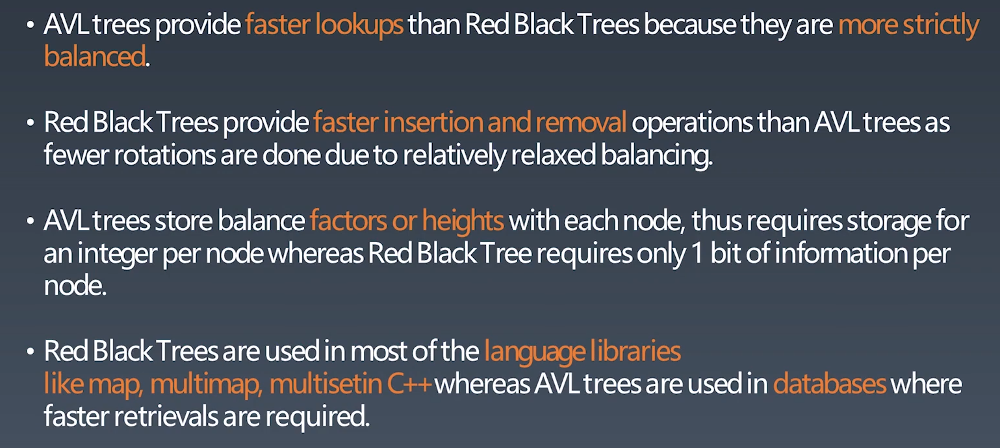

# 学习笔记

## 字典树

树的兄弟结点英文：siblings

1. 数据结构
   - 树形结构
2. 核心思想
3. 基本性质
   - 结点本身不存完成单词
   - 从根节点到某一节点，路径上经过的字符连接起来，为该结点对应的字符串
   - 每个结点的所有子结点路径代表的字符串都不相同
4. 优点
   - 最大限度减少无谓的字符串比较，查询效率比哈希表高

### 代码模板

```java
//Java
class Trie {
    private boolean isEnd;
    private Trie[] next;
    /** Initialize your data structure here. */
    public Trie() {
        isEnd = false;
        next = new Trie[26];
    }
    
    /** Inserts a word into the trie. */
    public void insert(String word) {
        if (word == null || word.length() == 0) return;
        Trie curr = this;
        char[] words = word.toCharArray();
        for (int i = 0;i < words.length;i++) {
            int n = words[i] - 'a';
            if (curr.next[n] == null) curr.next[n] = new Trie();
            curr = curr.next[n];
        }
        curr.isEnd = true;
    }
    
    /** Returns if the word is in the trie. */
    public boolean search(String word) {
        Trie node = searchPrefix(word);
        return node != null && node.isEnd;
    }
    
    /** Returns if there is any word in the trie that starts with the given prefix. */
    public boolean startsWith(String prefix) {
        Trie node = searchPrefix(prefix);
        return node != null;
    }

    private Trie searchPrefix(String word) {
        Trie node = this;
        char[] words = word.toCharArray();
        for (int i = 0;i < words.length;i++) {
            node = node.next[words[i] - 'a'];
            if (node == null) return null;
        }
        return node;
    }
}
```


## 并查集

### 用途

- 组团、配对问题

  ```java
  // Java
  class UnionFind { 
  	private int count = 0; 
  	private int[] parent; 
  	public UnionFind(int n) { 
  		count = n; 
  		parent = new int[n]; 
  		for (int i = 0; i < n; i++) { 
  			parent[i] = i;
  		}
  	} 
  	public int find(int p) { 
  		while (p != parent[p]) { 
  			parent[p] = parent[parent[p]]; 
  			p = parent[p]; 
  		}
  		return p; 
  	}
  	public void union(int p, int q) { 
  		int rootP = find(p); 
  		int rootQ = find(q); 
  		if (rootP == rootQ) return; 
  		parent[rootP] = rootQ; 
  		count--;
  	}
  }
  ```

  ### 基本操作

  1. makeSe(s) 创建并查集，其中包含s个单元素的集合
  2. unionSet(x,y) 钯元素x、y所造的集合合并 要求x、y所在的集合不想交，如果相交则不合并
  3. find(x) 找到元素x所在的集合的代表该操作也可以用来判断两个元素是否在同一个集合，只要将它们各自的代表比较一下就好了

  ### 实战题目

  1. [朋友圈](https://leetcode-cn.com/problems/friend-circles)
  2. [岛屿数量](https://leetcode-cn.com/problems/number-of-islands/)
  3. [被围绕的区域](https://leetcode-cn.com/problems/surrounded-regions/)

## 高级搜索

### 朴素搜索的优化方式

- 去重复、剪枝
- 搜索方向的优化

### 搜索方向

- **DFS**
- **BFS**
- **双向搜索**、**启发式搜索**

### DFS代码模板

```java
//Java
    public List<List<Integer>> levelOrder(TreeNode root) {
        List<List<Integer>> allResults = new ArrayList<>();
        if(root==null){
            return allResults;
        }
        travel(root,0,allResults);
        return allResults;
    }


    private void travel(TreeNode root,int level,List<List<Integer>> results){
        if(results.size()==level){
            results.add(new ArrayList<>());
        }
        results.get(level).add(root.val);
        if(root.left!=null){
            travel(root.left,level+1,results);
        }
        if(root.right!=null){
            travel(root.right,level+1,results);
        }
    }
```

### BFS代码模板

```java
//Java
public class TreeNode {
    int val;
    TreeNode left;
    TreeNode right;

    TreeNode(int x) {
        val = x;
    }
}

public List<List<Integer>> levelOrder(TreeNode root) {
    List<List<Integer>> allResults = new ArrayList<>();
    if (root == null) {
        return allResults;
    }
    Queue<TreeNode> nodes = new LinkedList<>();
    nodes.add(root);
    while (!nodes.isEmpty()) {
        int size = nodes.size();
        List<Integer> results = new ArrayList<>();
        for (int i = 0; i < size; i++) {
            TreeNode node = nodes.poll();
            results.add(node.val);
            if (node.left != null) {
                nodes.add(node.left);
            }
            if (node.right != null) {
                nodes.add(node.right);
            }
        }
        allResults.add(results);
    }
    return allResults;
}

```

### 剪枝

### 双向BFS

#### 实战题目

- [单词接龙](https://leetcode-cn.com/problems/word-ladder/)
- [最小基因变化](https://leetcode-cn.com/problems/minimum-genetic-mutation/)

### 启发式搜索（Heuristic Search A*）

本质上通过优先级不断的找目标，先用优先级高的

#### 估价函数

- 启发式函数：h(n) 用来评价哪些节点最有希望是我们要找的节点，h(h)会返回一个非负实数，也可以认为是从节点n目标节点的估计成本
- 启发式搜索是一种告知搜索方向的方法，它提供了一种明智的方法猜测哪个邻居节点会导向一个目标

#### 代码模板

```java
public class AStar
	{
		public final static int BAR = 1; // 障碍值
		public final static int PATH = 2; // 路径
		public final static int DIRECT_VALUE = 10; // 横竖移动代价
		public final static int OBLIQUE_VALUE = 14; // 斜移动代价
		
		Queue<Node> openList = new PriorityQueue<Node>(); // 优先队列(升序)
		List<Node> closeList = new ArrayList<Node>();
		
		/**
		 * 开始算法
		 */
		public void start(MapInfo mapInfo)
		{
			if(mapInfo==null) return;
			// clean
			openList.clear();
			closeList.clear();
			// 开始搜索
			openList.add(mapInfo.start);
			moveNodes(mapInfo);
		}
	

		/**
		 * 移动当前结点
		 */
		private void moveNodes(MapInfo mapInfo)
		{
			while (!openList.isEmpty())
			{
				Node current = openList.poll();
				closeList.add(current);
				addNeighborNodeInOpen(mapInfo,current);
				if (isCoordInClose(mapInfo.end.coord))
				{
					drawPath(mapInfo.maps, mapInfo.end);
					break;
				}
			}
		}
		
		/**
		 * 在二维数组中绘制路径
		 */
		private void drawPath(int[][] maps, Node end)
		{
			if(end==null||maps==null) return;
			System.out.println("总代价：" + end.G);
			while (end != null)
			{
				Coord c = end.coord;
				maps[c.y][c.x] = PATH;
				end = end.parent;
			}
		}
	

		/**
		 * 添加所有邻结点到open表
		 */
		private void addNeighborNodeInOpen(MapInfo mapInfo,Node current)
		{
			int x = current.coord.x;
			int y = current.coord.y;
			// 左
			addNeighborNodeInOpen(mapInfo,current, x - 1, y, DIRECT_VALUE);
			// 上
			addNeighborNodeInOpen(mapInfo,current, x, y - 1, DIRECT_VALUE);
			// 右
			addNeighborNodeInOpen(mapInfo,current, x + 1, y, DIRECT_VALUE);
			// 下
			addNeighborNodeInOpen(mapInfo,current, x, y + 1, DIRECT_VALUE);
			// 左上
			addNeighborNodeInOpen(mapInfo,current, x - 1, y - 1, OBLIQUE_VALUE);
			// 右上
			addNeighborNodeInOpen(mapInfo,current, x + 1, y - 1, OBLIQUE_VALUE);
			// 右下
			addNeighborNodeInOpen(mapInfo,current, x + 1, y + 1, OBLIQUE_VALUE);
			// 左下
			addNeighborNodeInOpen(mapInfo,current, x - 1, y + 1, OBLIQUE_VALUE);
		}
	

		/**
		 * 添加一个邻结点到open表
		 */
		private void addNeighborNodeInOpen(MapInfo mapInfo,Node current, int x, int y, int value)
		{
			if (canAddNodeToOpen(mapInfo,x, y))
			{
				Node end=mapInfo.end;
				Coord coord = new Coord(x, y);
				int G = current.G + value; // 计算邻结点的G值
				Node child = findNodeInOpen(coord);
				if (child == null)
				{
					int H=calcH(end.coord,coord); // 计算H值
					if(isEndNode(end.coord,coord))
					{
						child=end;
						child.parent=current;
						child.G=G;
						child.H=H;
					}
					else
					{
						child = new Node(coord, current, G, H);
					}
					openList.add(child);
				}
				else if (child.G > G)
				{
					child.G = G;
					child.parent = current;
					openList.add(child);
				}
			}
		}
	

		/**
		 * 从Open列表中查找结点
		 */
		private Node findNodeInOpen(Coord coord)
		{
			if (coord == null || openList.isEmpty()) return null;
			for (Node node : openList)
			{
				if (node.coord.equals(coord))
				{
					return node;
				}
			}
			return null;
		}
	

	

		/**
		 * 计算H的估值：“曼哈顿”法，坐标分别取差值相加
		 */
		private int calcH(Coord end,Coord coord)
		{
			return Math.abs(end.x - coord.x)
					+ Math.abs(end.y - coord.y);
		}
		
		/**
		 * 判断结点是否是最终结点
		 */
		private boolean isEndNode(Coord end,Coord coord)
		{
			return coord != null && end.equals(coord);
		}
	

		/**
		 * 判断结点能否放入Open列表
		 */
		private boolean canAddNodeToOpen(MapInfo mapInfo,int x, int y)
		{
			// 是否在地图中
			if (x < 0 || x >= mapInfo.width || y < 0 || y >= mapInfo.hight) return false;
			// 判断是否是不可通过的结点
			if (mapInfo.maps[y][x] == BAR) return false;
			// 判断结点是否存在close表
			if (isCoordInClose(x, y)) return false;
	

			return true;
		}
	

		/**
		 * 判断坐标是否在close表中
		 */
		private boolean isCoordInClose(Coord coord)
		{
			return coord!=null&&isCoordInClose(coord.x, coord.y);
		}
	

		/**
		 * 判断坐标是否在close表中
		 */
		private boolean isCoordInClose(int x, int y)
		{
			if (closeList.isEmpty()) return false;
			for (Node node : closeList)
			{
				if (node.coord.x == x && node.coord.y == y)
				{
					return true;
				}
			}
			return false;
		}
	}
```


## 红黑树和AVL树

#### 演进

树的本质就是链表，链表的next从一个扩散成两个的话，就变成了树，从一维变成了二维

二叉搜索树：查询效率从O(n)到O(logn),中序遍历为升序

二叉搜索树在极端情况下会退化成一个链表，此时变成了一个链表，为了维持查询效率，需要将其维护为平衡二叉树（包括AVL树和红黑树；treap、splay tree）

### AVL树

#### 概念

- 平衡因子：Balanceed Factor，左子树的高度与右子树高度差Balanceed Factor{-1，0，1}

- 旋转操作

  1. 左旋

     右右子树

  2. 右旋

     左左子树

  3. 左右旋

     左右子树

  4. 右左旋

     右左子树

#### 总结

##### 特性

1. 平衡二叉树
2. 每个节点存平衡因子
3. 四种旋转变换操作

##### 不足

1. 节点要存储额外信息，且调整次数频繁

### 红黑树

红黑树(Red-black Tree)是一种近似平衡的二叉搜索树(Binary Search Tree),他能确保任何一个结点的左右子树的高度小于两倍，具体来说，红黑树是满足以下性质的二叉搜索树

- 每个节点要么是红色，要么是黑色
- 根节点是黑色
- 每个叶子节点(NIL节点，空节点)是黑色
- 不能有相邻接的两个红色节点
- 从任一节点到其每个叶子节点的所有路径都包含相同数目的黑色节点

### 红黑树与AVL树对比

