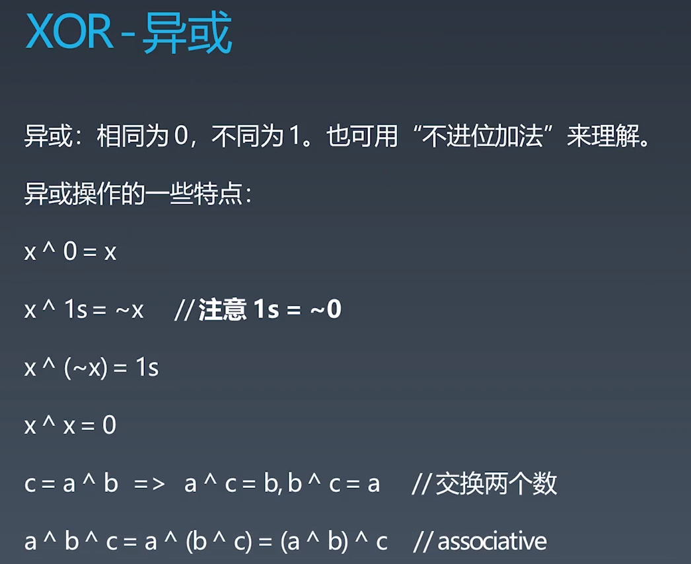
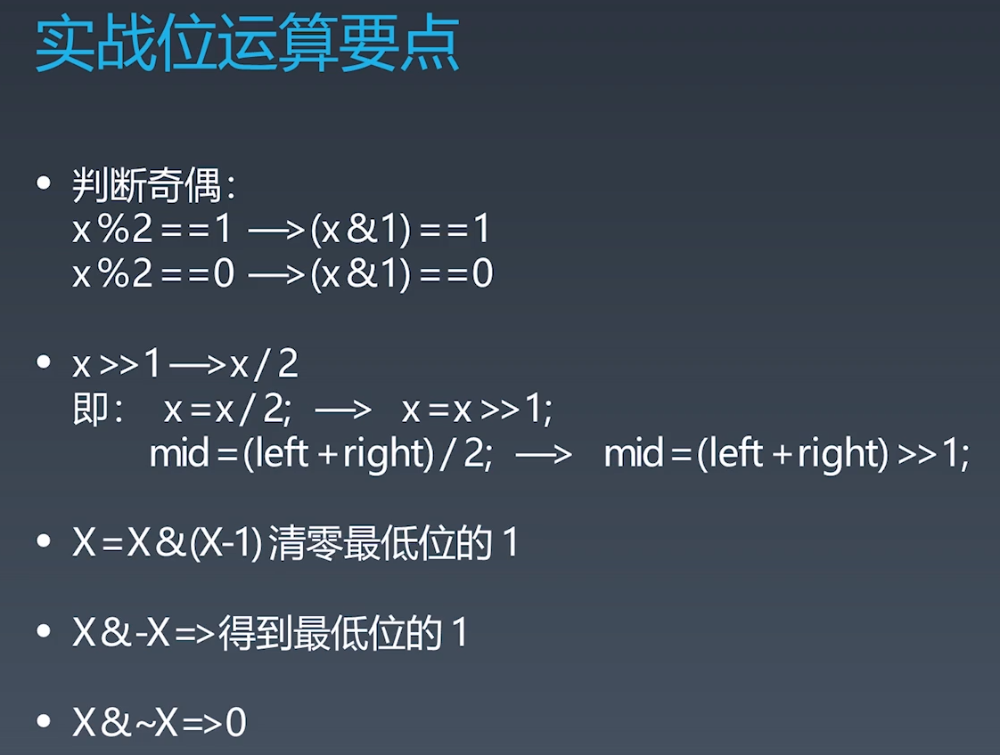
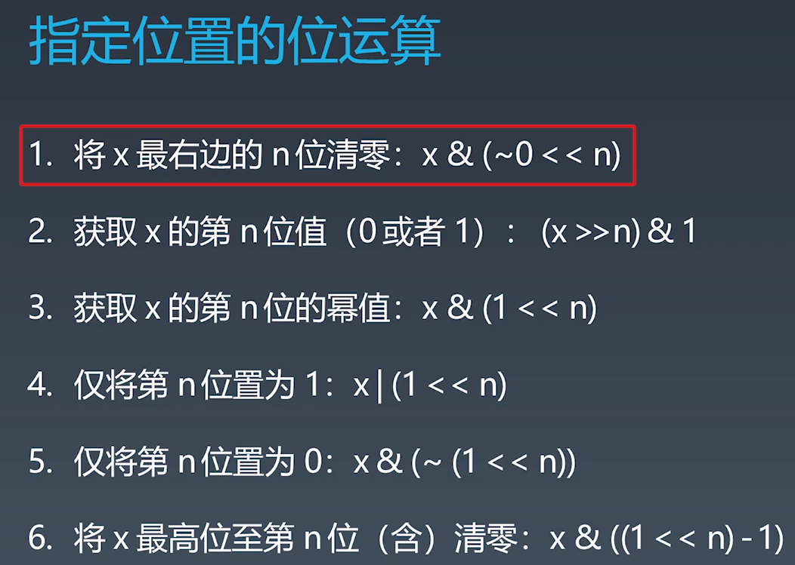
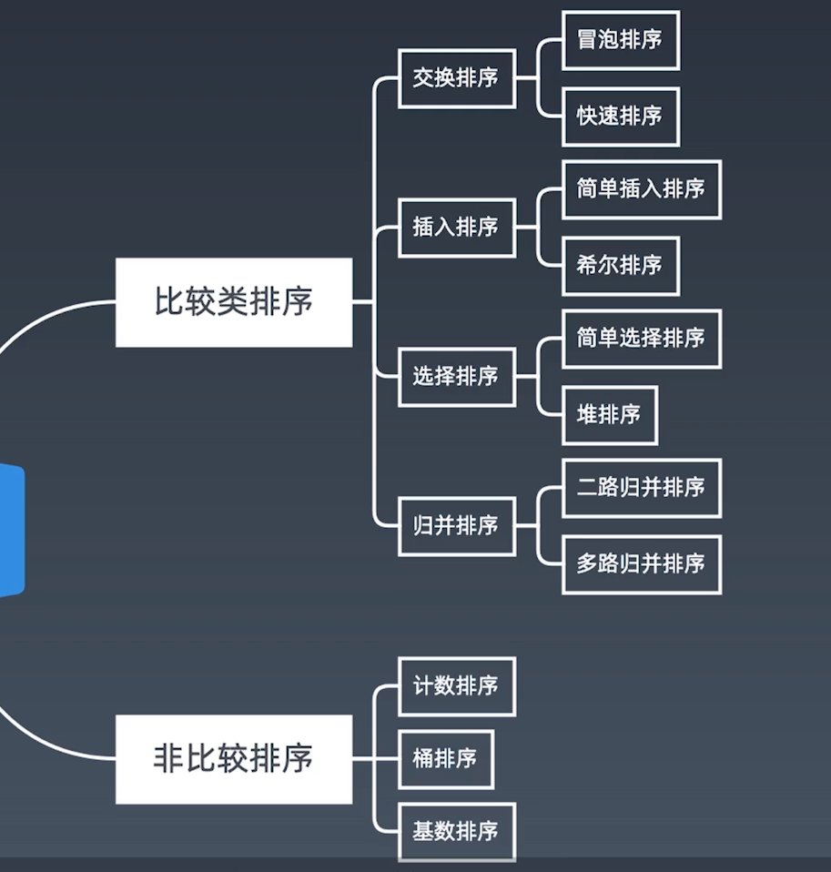
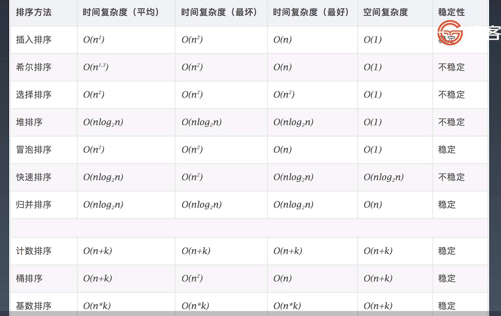
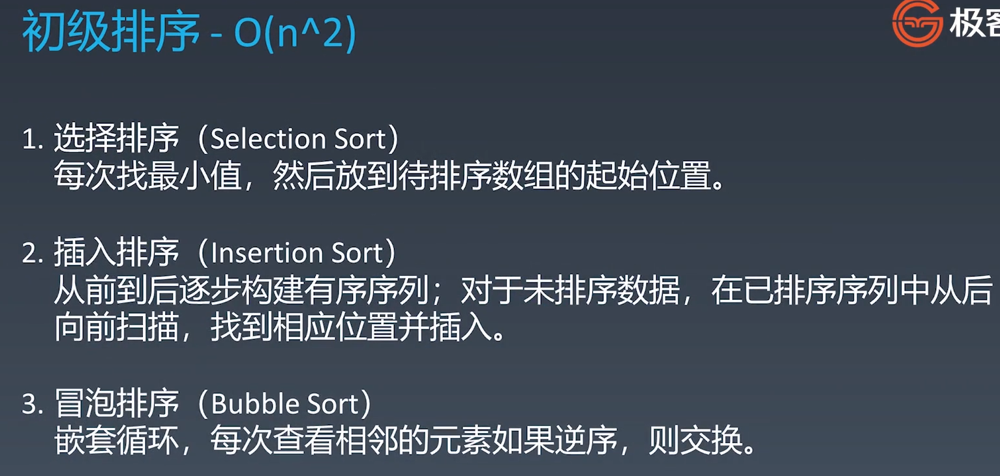
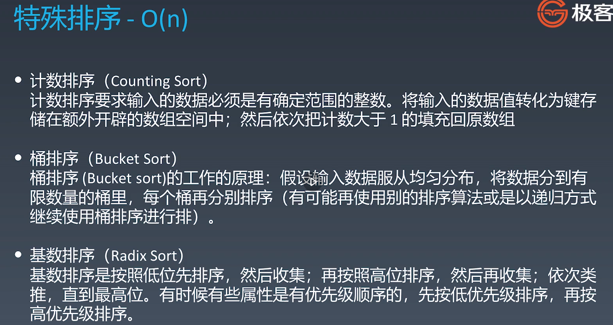

# 学习笔记

## 位运算

### 演进

- 机器里数字表示方式和存储格式是二进制

### 位运算符

1. 左移: <<
2. 右移: >>
3. 按位或 |
4. 按位与 &
5. 按位取反 ~
6. 按位异或 ^

### 算数移位与逻辑移位

### 位运算的运用

#### 异或



#### 位运算实战



#### 指定位置位运算



## 布隆过滤器

一个很长的二进制向量和一系列随机映射函数。可以用于检验一个元素是否在一个集合中。

### 优点

- 空间效率和查询时间远胜于一般算法。

#### 缺点

有一定的误识别率和删除困难。

## 排序算法

### 分类

- 比较类排序

  通过比较来决定元素之间的相对次序，由于其时间复杂度不能突破O(nlogn),因此也称为非线性时间比较类排序

- 非比较类排序

  不通过比较来决定元素之间的相对次序，它可以突破基于比较排序的时间下界，以线性时间运行，因此也称为线性时间非比较类排序。

### 十大排序算法



### 各排序算法时间复杂度



### 初级排序



### 高级排序

#### 思想

​	**分治**

- #### 快速排序

  数组取标杆pivot，将小元素放pivot左边，大元素放右侧，然后依次对左边和右边的子数组继续快排，以达到整个序列有序。

- **归并排序**

  1. 把长度为n的输入序列分成两个长度为n/2的子序列
  2. 对这两个子序列分别采用归并排序
  3. 将两个排序好的子序列合并成一个最终的排序序列

- **堆排序**

  - 堆插入O(logn) 取最大/最小值O(1)
  - 数组元素依次建立小顶堆
  - 依次取堆顶元素，并删除

### 特殊排序



### 代码示例

#### 冒泡排序

```java
public void bubbleSort(int[] nums) {
    if (nums == null || nums.length == 1) return;
    for (int i = 0; i < nums.length; i++) {
        for (int j = i + 1; j < nums.length; j++) {
            int tmp;
            if (nums[i] > nums[j]) {
                tmp = nums[j];
                nums[j] = nums[i];
                nums[i] = tmp;
            }
        }
    }
}
```

#### 选择排序

```java
public void selectionSort(int[] nums) {
    if (nums == null || nums.length == 1) return;
    int tmp;
    for (int i = 0; i < nums.length; i++) {
        int minIdx = i;
        for (int j = i + 1; j < nums.length; j++) {
            if (nums[j] < nums[minIdx]) {
                minIdx = j;
            }
        }
        tmp = nums[i];
        nums[i] = nums[minIdx];
        nums[minIdx] = tmp;
    }
}
```

#### 插入排序

```java
public void insertionSort(int[] nums) {
    if (nums == null || nums.length == 1) return;
    for (int i = 0; i < nums.length; i++) {
        for (int j = 0; j < i; j++) {
            int tmp;
            if (nums[i] < nums[j]) {
                tmp = nums[j];
                nums[j] = nums[i];
                nums[i] = tmp;
            }
        }
    }
}
```


#### 快速排序

```java
// Java
public static void quickSort(int[] array, int begin, int end) {
    if (end <= begin) return;
    int pivot = partition(array, begin, end);
    quickSort(array, begin, pivot - 1);
    quickSort(array, pivot + 1, end);
}
static int partition(int[] a, int begin, int end) {
    // pivot: 标杆位置，counter: 小于pivot的元素的个数
    int pivot = end, counter = begin;
    for (int i = begin; i < end; i++) {
        if (a[i] < a[pivot]) {
            int temp = a[counter]; a[counter] = a[i]; a[i] = temp;
            counter++;
        }
    }
    int temp = a[pivot]; a[pivot] = a[counter]; a[counter] = temp;
    return counter;
}
```

#### 归并排序

```java
// Java

public static void mergeSort(int[] array, int left, int right) {
    if (right <= left) return;
    int mid = (left + right) >> 1; // (left + right) / 2

    mergeSort(array, left, mid);
    mergeSort(array, mid + 1, right);
    merge(array, left, mid, right);
}

public static void merge(int[] arr, int left, int mid, int right) {
        int[] temp = new int[right - left + 1]; // 中间数组
        int i = left, j = mid + 1, k = 0;

        while (i <= mid && j <= right) {
            temp[k++] = arr[i] <= arr[j] ? arr[i++] : arr[j++];
        }

        while (i <= mid)   temp[k++] = arr[i++];
        while (j <= right) temp[k++] = arr[j++];

        for (int p = 0; p < temp.length; p++) {
            arr[left + p] = temp[p];
        }
        // 也可以用 System.arraycopy(a, start1, b, start2, length)
    }
```

#### 堆排序

```java
// Java
static void heapify(int[] array, int length, int i) {
    int left = 2 * i + 1, right = 2 * i + 2；
    int largest = i;
    if (left < length && array[left] > array[largest]) {
        largest = left;
    }
    if (right < length && array[right] > array[largest]) {
        largest = right;
    }
    if (largest != i) {
        int temp = array[i]; array[i] = array[largest]; array[largest] = temp;
        heapify(array, length, largest);
    }
}
public static void heapSort(int[] array) {
    if (array.length == 0) return;
    int length = array.length;
    for (int i = length / 2-1; i >= 0; i-) 
        heapify(array, length, i);
    for (int i = length - 1; i >= 0; i--) {
        int temp = array[0]; array[0] = array[i]; array[i] = temp;
        heapify(array, i, 0);
    }
}
```

